## Table of contents

- [Table of contents](#table-of-contents)
- [Problem and Motivation ](#problem-and-motivation-)
- [Background](#background)
  - [Literature Review](#literature-review)
  - [Datasets](#datasets)
    - [RVENet Dataset (\[link\], \[4\])](#rvenet-dataset-link-4)
    - [Heart Failure Clinical Records (link, \[5\])](#heart-failure-clinical-records-link-5)
- [Methods](#methods)
  - [Data Preprocessing Methods](#data-preprocessing-methods)
    - [Heart Failure Clinical Records (Anomaly detection - Isolation Forest)](#heart-failure-clinical-records-anomaly-detection---isolation-forest)
    - [DICOM Preprocessing](#dicom-preprocessing)
  - [ML Algorithms](#ml-algorithms)
    - [Random Forest Regression/Classification](#random-forest-regressionclassification)
    - [Neural Network](#neural-network)
      - [Model Survey - Temporal CNN](#model-survey---temporal-cnn)
      - [Model Survey - Transformer Architecture](#model-survey---transformer-architecture)
      - [Best Model Yet - CardiacCycleRNN !!](#best-model-yet---cardiaccyclernn-)
      - [Supplementing CardiacCycleRNN with additional features](#supplementing-cardiaccyclernn-with-additional-features)
  - [Creating Patient Personas](#creating-patient-personas)
    - [Dataset merging using K Nearest Neighbors](#dataset-merging-using-k-nearest-neighbors)
    - [Predictive Model Development Using Iterative Imputation](#predictive-model-development-using-iterative-imputation)
    - [Heurisitic-based Data Concatenation](#heurisitic-based-data-concatenation)
  - [Generating DICOM Summary](#generating-dicom-summary)
- [Complete Pipeline](#complete-pipeline)
- [Results and Discussion](#results-and-discussion)
  - [Random Forest for Feature Importance Analysis](#random-forest-for-feature-importance-analysis)
  - [CardiacCycleRNN for predicting RVEF](#cardiaccyclernn-for-predicting-rvef)
  - [Supplementing CardiacCycleRNN with additional features](#supplementing-cardiaccyclernn-with-additional-features-1)
  - [Next Steps](#next-steps)
- [References](#references)
  - [Dataset Reference Links:](#dataset-reference-links)
- [Video Presentation](#video-presentation)
- [Gantt Chart](#gantt-chart)
- [Contribution Table](#contribution-table)

---

## Problem and Motivation <a name="ProblemandMotivation"></a>

---

In modern clinical practice, diagnosing illnesses involves analyzing diverse data like patient history, symptoms, and diagnostic reports, which can be time-consuming and error-prone.

Our project aims to develop a scalable and resolute **MultiModal disease diagnosis and treatment** system focused on cardiovascular function. Using ML, we integrate echocardiographic videos with a patient condition severity dataset to assist physicians in diagnosing and suggesting treatments.

## Background

---

### Literature Review

Recent advances in biomedical sciences have boosted the usage of ML in assessing cardiac functions. Stanford's EchoNet-Dynamic outperforms human experts in segmenting the left ventricle (LV), estimating ejection fraction (EF), and assessing cardiomyopathy [[1]](https://www.nature.com/articles/s41586-020-2145-8).

Another study used a DL model to estimate Right Ventricular EF (RVEF) from 2D echocardiographic videos [[2]](https://www.sciencedirect.com/science/article/pii/S1936878X23001146). Researchers also explored supervised ML algorithms to predict cardiovascular diseases using variables like age, gender, and weight [[3]](https://ieeexplore.ieee.org/abstract/document/9497837).

Despite these advancements, a significant gap remains in research that focuses on developing **MultiModal disease diagnosis and treatment** plans, which this project aims to address.

### Datasets

#### RVENet Dataset ([[link]](https://rvenet.github.io/dataset/), [[4]](https://doi.org/10.1007/978-3-031-25066-8_33))

EF is an important indicator of cardiac function. RVENet offers 3,583 2D echocardiographic videos from 831 patients, along with corresponding ground truth RVEF values. Key labels of interest in this dataset include patient group, age, sex, and RVEF. This dataset can be leveraged for regression tasks to predict RVEF from the videos.

<div align="center">
    
    <p><em><a href="https://rvenet.github.io/dataset/">Feature description</a></em></p>
</div>

#### Heart Failure Clinical Records ([link](https://archive.ics.uci.edu/dataset/519/heart+failure+clinical+records), [[5]](https://doi.org/10.1186/s12911-020-1023-5))

This dataset includes the medical records of 299 heart failure patients, with key features such as age, ejection fraction, sex, and death event. By combining this dataset with feature predictions from RVENet, it can be used to evaluate the severity or likelihood of cardiac issues.

<div align="center">
    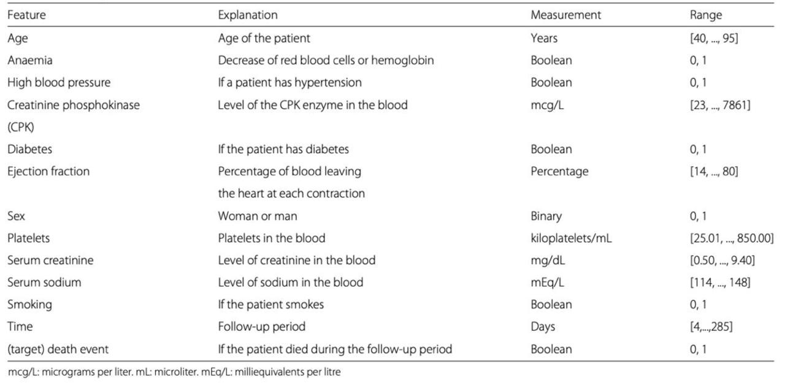
    <p><em><a href="https://bmcmedinformdecismak.biomedcentral.com/articles/10.1186/s12911-020-1023-5">Feature description</a></em></p>
</div>

## Methods

---

### Data Preprocessing Methods

#### Heart Failure Clinical Records (Anomaly detection - Isolation Forest)

Outliers hinder the logistic regression models deployed to perform accurate classification. We used **Isolation Forest** *(unsupervised learning)* to detect outliers by constructing random trees where outliers have shorter paths, as they differ significantly from the majority of the data ([link](https://arxiv.org/abs/2206.06602)).

Looking at the heart failure clinical dataset, we were observing a large number of outliers. A visualization of the data points in the feature space can be seen here.

<div align="center">
    
    <p><em>Outliers Detection Visualization</em></p>
</div>

Using isolation forest, we can eliminate the noisy samples in order for a more robust multi-modal pipeline. 

The model is initialized with the contamination parameter as 0.05, which indicates that the algorithm assumes that 5% of the data is contaminated with outliers. We then fit the Isolation Forest model to the normalized data, learning the patterns of what the "inliers" (normal data points) and "outliers" (anomalous points) are based on the isolation process. We then save the cleaned inliers points, to be used further up in the processing pipeline.

 Post removal of outliers, we are left with 284 samples. The code can be accessed at **models/auxiliary/text_preprocessing.py**.

#### DICOM Preprocessing

The RVENet Dataset is composed of multiple DICOM (Digital Imaging and Communications in Medicine) files, a widely used standard format for storing and transmitting medical imaging data. Each DICOM file in the RVENet dataset contains both image data and corresponding metadata, enabling comprehensive analysis and diagnostics. The images are structured as multi-frame sequences, with each frame sized at 600x800 pixels and including three color channels (600x800x3). In addition to the image data, each file’s metadata provides critical information, such as heart rate, frames per second (fps), date of capture, planar configuration, total frame count, and manufacturer details.

Ejection Fraction is assessed over a single cardiac cycle, with each cycle serving as an individual data point for our model. To extract frames for each cardiac cycle, we use the heart rate and frames per second (fps) values from the metadata to calculate the cycle's duration in frames. Based on this calculated length, we segment frames accordingly, processing each frame within a cycle before feeding the complete cycle set into the model. This approach ensures accurate and consistent data representation for model training and evaluation.

Below is a sample image from the dataset. To identify significant features, we calculate and analyze the pixels that vary throughout the cardiac cycle in (b). This allows us to pinpoint essential features within the image, filtering out extraneous information and retaining only the most relevant data for the model. We observe that only the section of the frame capturing the heart’s ultrasound exhibits meaningful changes, confirming it as the focal region for our analysis. By isolating this area, we will ensure that the model receives the critical features needed for accurate assessment.

<p align="center">
  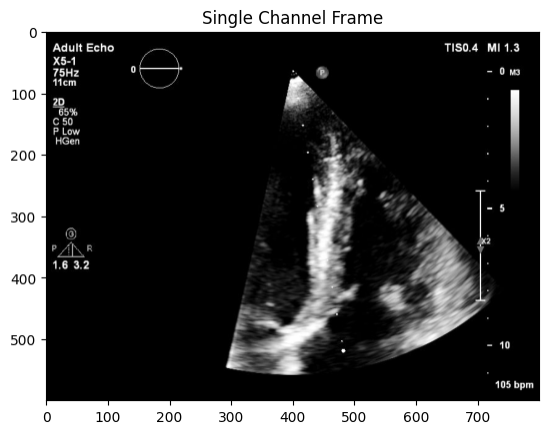
  
</p>

To enhance feature isolation, we apply **binary masking** *(Unsupervised Learning)* to each frame in the image sequence. For each pixel, if the intensity change is at least 10, the pixel is retained; otherwise, it is masked out. To refine the mask, we perform morphological erosion with a 5x5 kernel, which helps to isolate individual elements and consolidate fragmented regions, producing a cleaner and more focused mask that highlights only the relevant areas.

<div align="center">
    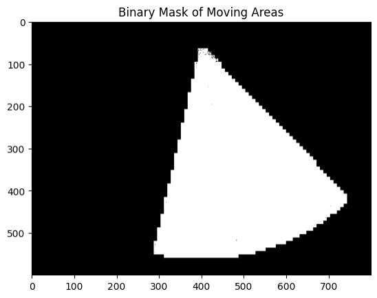
</div>

We apply the mask to crop the image and then scale it to a size of 224x224, which is the standard input size for most models. To provide context for the model regarding the changes, we structure the input as a three-channel image. One channel is a binary mask, while the remaining two channels are identical and contain the cropped and scaled grayscale image. We also normalize the pixel values across the frames to ensure a more consistent and spread-out range of values. This approach ensures the model can effectively interpret the masked regions and the relevant changes in the image.

<div align="center">
    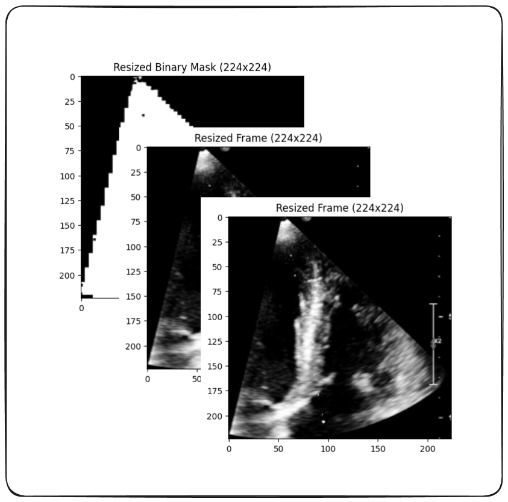
    <p>DICOM input tensor post pre-processing (3,224,224)</p>
</div>

Optimizing Input Feed Speed – Our neural network model, which requires significant GPU resources, initially encountered "CUDA OUT OF MEMORY" errors when attempting to load all input data as a single tensor. To address this, we used data loaders with batch-wise loading and parallel num_workers, resolving memory issues. However, loading data each epoch remained time-consuming. To speed up training, we innovated by saving the preprocessed input tensors to local disk and loading them directly into the data loader. This approach drastically reduced epoch time from **12 mins/epoch** to **2mins/epoch** as loading tensors from disk is much faster than reprocessing raw data.

### ML Algorithms

#### Random Forest Regression/Classification

In this study, a supervised machine learning pipeline was developed to predict the right ventricular ejection fraction (RVEF) using a Random Forest Regressor model. The data was preprocessed, and both regression and classification models were trained and evaluated on their respective tasks.

The dataset from codebook.csv was preprocessed using a custom Data Preprocessor class. Irrelevant columns (File Name, Patient Hash, Ultrasound System, and Video Quality) were removed since the Random Forest Regressor model didn't use the corresponding dicom images. Categorical features (Patient Group, Sex, and Split) were label-encoded. A binary classification feature, RVEF_Status, was created based on an RVEF threshold of 50% (normal: RVEF ≥ 50%, reduced: RVEF < 50%). The features were standardized using Standard Scaler and split into training and testing datasets with an 80:20 ratio.

We used Random Forest model for both regression and classification tasks due to its ability to handle complex, non-linear relationships and reduce overfitting. The Random Forest Regressor was specifically used for predicting RVEF values. This model provides feature importance scores, enhancing interpretability, and performs well on small to medium-sized datasets with mixed data types.

#### Neural Network

##### Model Survey - Temporal CNN

We constructed a temporal convolutional neural network (TCN) using a ResNeXt model as the backbone, followed by a temporal convolutional network and final linear layers. Each 3-channel input frame is passed through the ResNeXt backbone to extract image features. The backbone’s output undergoes a dimension transformation to stack all tensors within a cardiac cycle together before feeding them to the temporal convolutional network. The TCN's output is then passed through a linear layer for regression. We trained this model over several epochs but did not achieve the expected results as we achieve convergence on training dataset vut our loss on validation dataset oscillates. This is an indication that the model overfits and we would need more data to train the model and get accuracy on validation dataset.

<div align="center">
    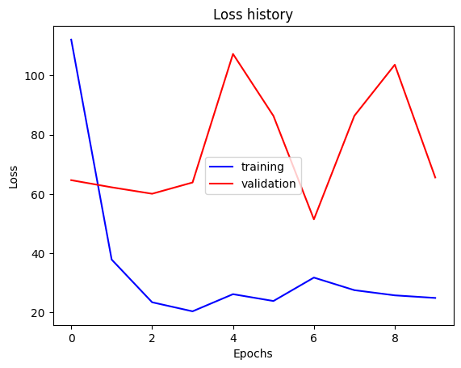
    <p><em>TemporalCNN MSE loss - failure to converge on validation dataset</em></p>
</div>

##### Model Survey - Transformer Architecture

In order to learn the sequential aspects of the EF-based dataset, we also experimented with Transformer based architectures. Transformers have proven to be very beneficial in learning context from large sequences, even in complex datasets. Furthermore, the Transformer architecture consists of stacked layers of self-attention and feed-forward networks, with residual connections and layer normalization. These components facilitate deep learning and efficient training, making Transformers particularly advantageous for tasks involving large, complex datasets with long-range dependencies. 

The network combines a pre-trained ResNet-18 model with a Transformer encoder for sequence processing, followed by a fully connected layer for regression. The output of the Transformer encoder is fed into a fully connected layer, which predicts a continuous value using mean squared error (MSE) loss for regression tasks.

<div align="center">
    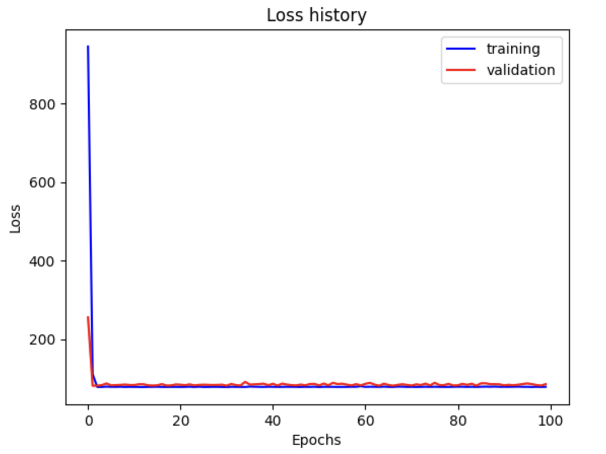
    <p><em>Transformer MSE loss - failure to converge</em></p>
</div>

However, the Transformer model did not converge as expected, likely due to an insufficient number of layers, which hindered its ability to capture complex dependencies in the data. Transformers require careful tuning of hyperparameters, particularly the number of layers and attention heads, to fully leverage their potential. On the other hand, the LSTM (RNN) model outperformed the Transformer due to its simpler architecture, which is inherently better suited for modeling sequential data with strong short-term dependencies. LSTMs excel at retaining memory of previous steps in the sequence, making them more effective for tasks where local, step-by-step relationships are crucial. Additionally, LSTMs tend to be more stable during training and require fewer resources to train, which can be advantageous for smaller datasets or less complex tasks.

##### Best Model Yet - CardiacCycleRNN !!

The CardiacCycleRNN is a deep learning mode (RNN) designed to process and analyse cardiac cycle data. This model combines convolutional and recurrent neural network architectures to extract features from cardiac images and capture temporal dependencies across multiple cardiac cycles.

Feature Extraction
The model utilizes a pre-trained ResNet-18 architecture as its feature extractor:

    resnet = models.resnet18(pretrained=True)
    self.feature_extractor = nn.Sequential(*list(resnet.children())[:-1])
        
This approach leverages transfer learning, allowing the model to benefit from features learned on large-scale image datasets. The final fully connected layer of ResNet-18 is removed, leaving the model with a feature vector output for each input image.

Recurrent Processing: To capture temporal dependencies across cardiac cycles, the model employs a Long Short-Term Memory (LSTM) network:

     self.rnn = nn.LSTM(input_size=feature_size, 
                         hidden_size=rnn_hidden_size, 
                         num_layers=num_rnn_layers, 
                         batch_first=True)
                         
The LSTM processes the sequence of feature vectors extracted from each cardiac cycle, allowing the model to learn and remember important patterns over time.

Output Layer: The final prediction is made using a fully connected layer that takes the last output of the LSTM:

    self.fc = nn.Linear(rnn_hidden_size, 1)
          
This layer produces a single scalar output, which could represent a specific cardiac parameter.

Forward Pass: 

During the forward pass, the model performs the following steps:
1.	Extracts features from each cardiac cycle image using the ResNet-18 feature extractor.
2.	Stacks the features from all cycles to create a sequence.
3.	Processes the feature sequence through the LSTM.
4.	Uses the final LSTM output to make a prediction via the fully connected layer.
   
Model Parameters

- RNN Hidden Size: 128 
- Number of RNN Layers: 1 
- Loss Function: Mean Squared Error (MSE)

##### Supplementing CardiacCycleRNN with additional features

As noted from [Random Forest Regression/Classification](#random-forest-regressionclassification), RVEF can be predicted with good accuracy with just the parameters present in the patient dataset without processing DICOM files. Thus these parameters can be helpful in improving the accuracy of our model. The age and heart rate parameters are present in the DICOM files but they were discarded in the earlier dataloader. We incorporate these into our model and add 3 small fully-connected layers to incorporate these into the prediction made by the earlier RNN. This is done by returning a dictionary containing two tensors (different shaped) instead of just 1 during the dataloader and handling it in the forward function of the network. The training accuracy improvement from this approach is shown in [Supplementing with additional features](#supplementing-with-additional-features)

<div align="center">
    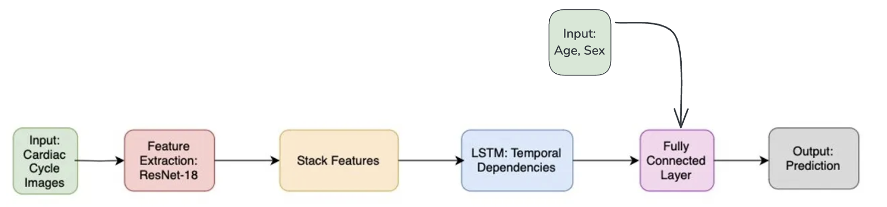
    <p><em>CardiacCycleRNN with Augmented Features</em></p>
</div>

### Creating Patient Personas

Now that we have a method to predict the RVEF values for a given input data point, we would like to extend multimodality with textual descriptors.
This will enhance the richness of the prediction of our LLM model, while also increasing the information available for final decision making for the doctor.

#### Dataset merging using K Nearest Neighbors

The merging technique integrates two datasets (codebook and heart_failure) using the k-nearest neighbors (k-NN) algorithm. Selected features are preprocessed with one-hot encoding and standard scaling to ensure compatibility. For each record in the heart_failure dataset, the k-NN model identifies the nearest records in the codebook dataset based on scaled feature distances, and these matched records are merged by combining their attributes.

After the merge, the resulting dataset expanded to 1420 rows and 29 columns, compared to the initial codebook.csv which contained 3583 rows and 16 columns. This transformation captures additional attributes and aligns the datasets structurally.

However, this algorithm and merging technique have limitations:

Loss of Original Data Variability: By matching based on a limited set of features, the k-NN algorithm may oversimplify relationships, ignoring potentially important variations present in other features.
Arbitrary Nearest Neighbors: The selection of nearest neighbors depends heavily on the choice of features and scaling, which might not accurately reflect the true similarity between records.
Data Imbalance: The merge reduces the dataset size from 3583 rows to 1420 rows, which may discard valuable information from the codebook.csv.

A Random Forest algorithm was trained using features from the merged dataset, with Right Ventricular Ejection Fraction (RVEF) as the target variable. Despite the diverse features available in the dataset, the model's feature importance analysis revealed that only Heart Rate and Age had substantial contributions, while other critical features, such as biomarkers and comorbidities, were underrepresented. This imbalance highlights the limitations of the merging technique, which likely skewed the data distribution. The cross-validation MSE scores, averaging  1.83e-25, were unrealistically low, suggesting overfitting or numerical artifacts rather than meaningful generalization. These observations underline the need to refine the merging process to better capture the variability and clinical relevance of the features, ensuring a more balanced and effective model for predicting RVEF.

<div align="center">
    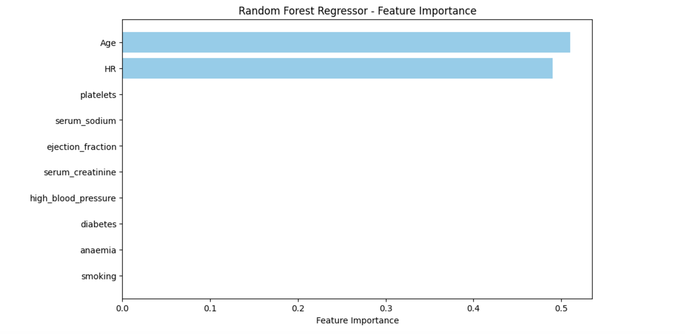
    <p><em>Feature Importance post dataset merging using KNN</em></p>
</div>

#### Predictive Model Development Using Iterative Imputation

In this analysis, a predictive model was developed to estimate Right Ventricular Ejection Fraction (RVEF) by integrating data from a codebook.csv file and a cleaned heart failure dataset (cleaned_file.csv). The merging process involved aligning the two datasets based on age and sex, with the heart failure data aggregated by mean values across these demographic variables. The merged dataset retained the same number of rows as the original codebook, ensuring no records were dropped during the merge. However, the merging resulted in some features containing missing values due to incomplete matches, which were subsequently imputed using an Iterative Imputer based on Random Forest regressors.

Iterative imputation handles missing data by predicting and filling in gaps using the existing dataset information. The process starts with simple imputation (e.g., mean or median) to initially fill missing values. Predictive models, in this case, Random Forest regressors, are then trained on the complete features to predict the missing values iteratively. This process, called iterative refinement, updates the imputed values in multiple iterations, refining predictions until changes are minimal. Key clinical metrics such as serum creatinine, ejection fraction, and comorbidities like diabetes and high blood pressure were imputed using this technique, leveraging the relationships between these variables to maintain dataset integrity.

A Random Forest algorithm was trained on the merged dataset with RVEF as the target variable, achieving a Mean Squared Error (MSE) of approximately value. Feature importance analysis indicated balanced contributions from various features, suggesting that the merging and imputation processes effectively represented critical variables. While iterative imputation improved data completeness, it might have introduced bias by filling gaps based on existing data patterns, potentially overestimating correlations.

<div align="center">
    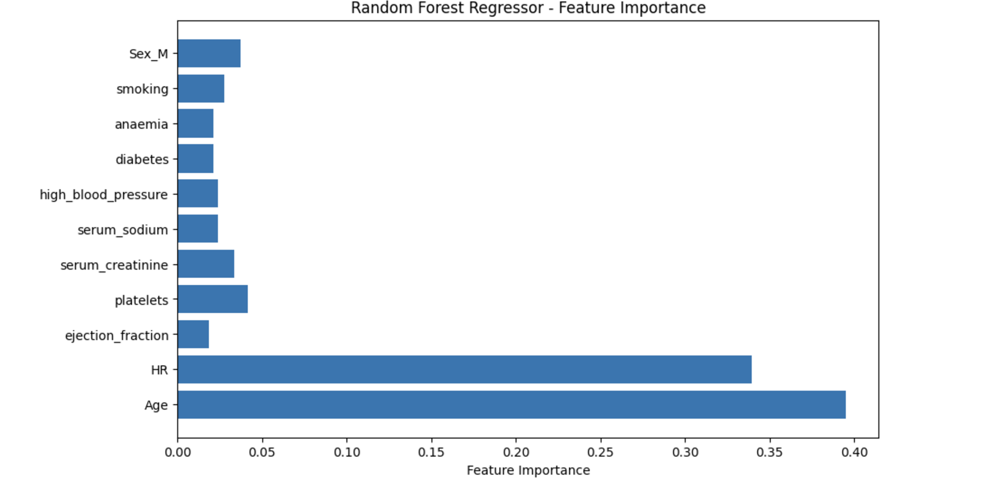
    <p><em>Feature Importance post dataset merging</em></p>
</div>

#### Heurisitic-based Data Concatenation

This method involves using data pre-processing heuristics to combine datasets based on the age feature- which is common in both our DICOM and Caridovascular disease dataset. In order to obtain more verbose patient personas, we created age bins in the cardiovascular disease dataset and clustered the points into 10 buckets (from 0-10,..90-100). We then took an average of all the important features in the cardiovascular dataset based on the clusters.
<div align="center">
    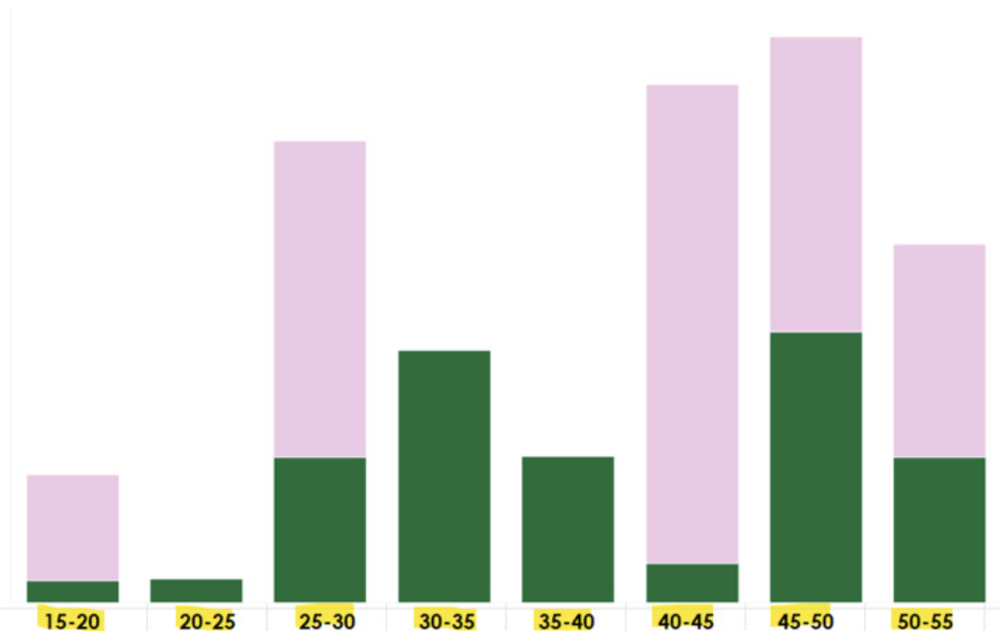
    <p><em>Bucketizing</em></p>
</div>


Once this was completed, we then take each point from the DICOM dataset, pick up it's age, and based on which bucket it belongs to, append the average of the remaining features from the cardiovascular dataset. This intuitively represents the likely characteristics of the patient based on his/her age group and sex.

This process is more stable to implement compared to learning based approaches because of the lack of data in the cardiovascular dataset- we will not be able to define an accurate model that doesn't underfit on the remaining test samples.

### Generating DICOM Summary


This code implements a medical data summarization system using two powerful language models in a complementary setup. The system primarily relies on Llama 3 (8B Instruct) accessed through OpenRouter's API infrastructure. The getRephrased2() function handles all communications with this model. The summarization process begins with the getSummary() function, which utilizes Gemini 1.5 Flash via Google's API. The prompt is designed to focus on specific medical attributes such as  patient details, grouping, heart rate, ultrasound system specifications, video characteristics, and RV metrics. Here's the prompt:

```
"Summarize the following row of medical data. You can ignore the first two rows. Understand how the person's health is with respect to FileName, PatientHash, PatientGroup, Age, Sex, HR, UltrasoundSystem, FPS, NumFrames, VideoViewType, VideoOrientation, VideoQuality, RVEDV, RVESV, RVEF, Split, anaemia, creatinine_phosphokinase, diabetes, high_blood_pressure, platelets, serum_creatinine, serum_sodium, sex, smoking, DEATH_EVENT. A healthy right ventricular ejection fraction (RVEF) is generally considered to be 55% to 75%:**

- 55–70%: Normal heart function.  
- 40–55%: Below normal heart function, which could indicate previous heart damage.  
- Higher than 75%: Could indicate a heart condition like hypertrophic cardiomyopathy.  
- Less than 40%: May confirm the diagnosis of heart failure. We need the other features of the point highlighted as well. The order of the features which come is: FileName, PatientHash, PatientGroup, Age, Sex, HR, UltrasoundSystem, FPS, NumFrames, VideoViewType, VideoOrientation, VideoQuality, RVEDV, RVESV, RVEF, Split, anaemia, creatinine_phosphokinase, diabetes, ejection_fraction, high_blood_pressure, platelets, serum_creatinine, serum_sodium, smoking. Other statistics.

For Anaemia, any score above 0.4 indicates a poor score, making individuals susceptible to blood loss. For diabetes, any ratio above 0.34 indicates high susceptibility to heart attacks. Do the same analysis with high blood pressure - any BP above 0.329 is alarming.

Also, if some attributes are empty, mention as they are empty in response because data isn’t available in lookup. Summarize well, but include ---."  
"### {} ###"
```


## Complete Pipeline


<div align="center">
    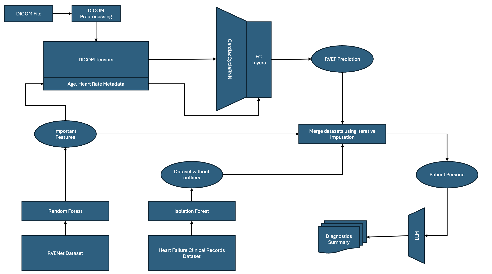
    <p><em>Complete Pipeline of ECGenius</em></p>
</div>

## Results and Discussion

Evaluation Metrics used:
- Mean Square Error (MSE)
- Mean Absolute Error (MAE)
- F1 score 
- Precision 
- Recall

### Random Forest for Feature Importance Analysis

The performance of the **Random Forest models** for both the regression and classification tasks was assessed using relevant metrics.

-  Regression Model Evaluation:
The Random Forest Regressor’s performance in predicting continuous RVEF values was evaluated using Mean Squared Error (MSE) and Mean Absolute Error (MAE). For these models we just used four features namely Age, Sex, Heart Rate and Patient Group.

<div align="center">
    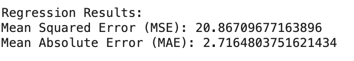
    <p><em> MSE and MAE for Random Forest Regression</em></p>
</div>

-  Classification Model Evaluation:
For the binary classification task, the Random Forest Classifier was evaluated on its ability to predict RVEF Status (normal vs. reduced) using accuracy, precision, recall, and F1-score. The classification report reveals an accuracy score of 92.9%, with precision and recall values of 0.93 and 0.96, for normal and 0.88 and 0.80 for reduced respectively. The F1-score, a balance between precision and recall, was recorded as 0.95 and 0.84 for normal and reduced respectively.  indicating the classifier’s balanced performance in identifying both normal and reduced RVEF cases.

<div align="center">
    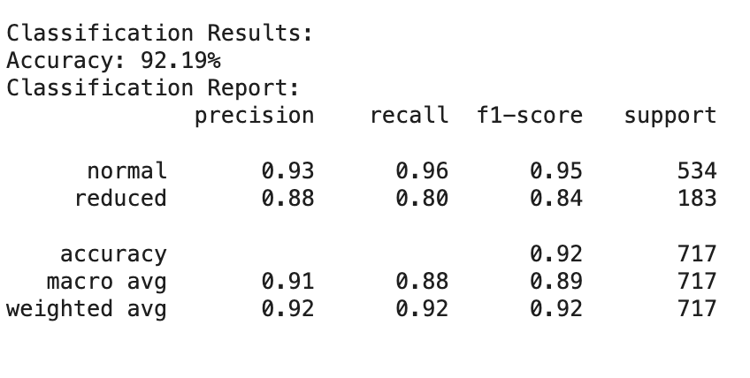
    <p><em>Evaluation Metrics for Random Forest Clasification - Normal or Reduced </em></p>
</div>

- Feature Importance Analysis

Feature importance analysis was conducted to identify the importance of the features - age, sex, patient group and heartrate for RVEF in the regression model. Below plot shows top features that likely capture critical aspects of the physiological or demographic factors associated with variations in RVEF.

<div align="center">
    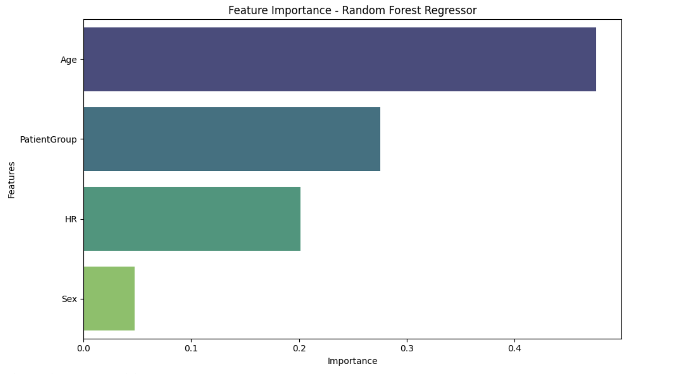
    <p><em>Feature Importance for Random Forest Regression Model</em></p>
</div>

### CardiacCycleRNN for predicting RVEF

The training loss values show considerable variation across different iterations within the final epoch, all the error measured is MSE.
- Mean Training Loss: 81.0822
- Final Validation Loss: 82.75

<div align="center">
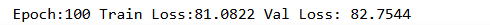
<p>Training and Validation Loss for RNN 100th Epoch</p>
</div>

We observe a standard deviation of 23.22 in training loss which indicates significant fluctuations in the training loss, suggesting that the model's performance may be inconsistent across different batches or samples.

<div align="center">
    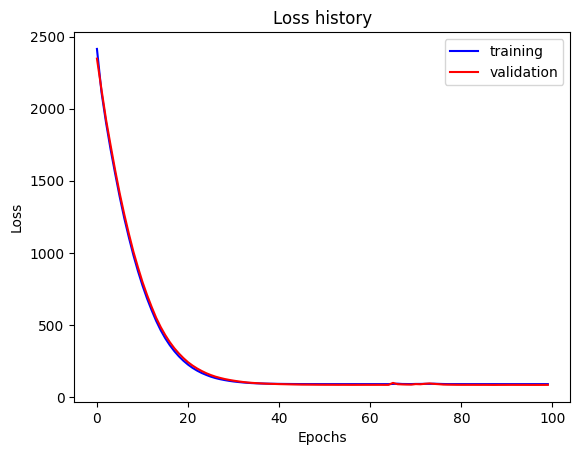
    <p>Training and Validation Loss for RNN model</p>
</div>

The image above depicts the Mean Squared Error (MSE) loss for both the training and validation sets over 100 epochs. The graph provides a clear visualization of the model's learning process and its generalization performance on unseen data.

- At the start of training (epoch 0), both the training and validation losses are quite high, around 2500. This is expected as the model begins with random weights and has not yet learned any meaningful patterns from the data.
- During the first 20 epochs, there is a sharp decline in both the training and validation losses. This indicates that the model is learning quickly and effectively adjusting its parameters to reduce error.
- After approximately 20 epochs, both the training and validation losses start to flatten out, indicating that the model is approaching convergence. The losses remain relatively stable after this point, with only minor fluctuations.
- Throughout the entire training process, the training and validation losses are very close to each other. This suggests that the model is not overfitting to the training data, as there is no significant gap between these two curves.
- By epoch 100, both the training and validation losses have converged to low values around 80–90. This indicates that the model has learned to minimize error effectively on both the training set and unseen validation data.

### Supplementing CardiacCycleRNN with additional features

Supplementing the RVEF prediction pipeline with age and heart rate parameters from the DICOM files helps us in achieving convergence much faster, this is demonstrated from the following loss curves:

<div align="center">
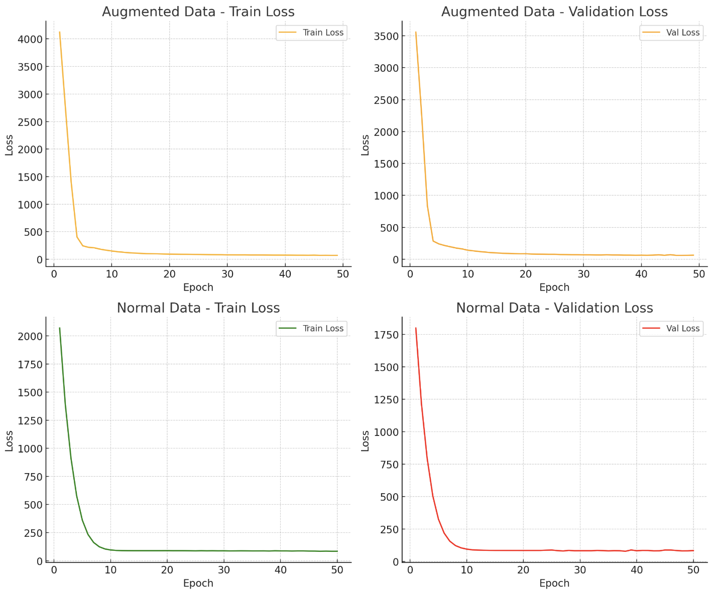
<p>Normal data vs Augmented Data case for CardiacCycleRNN</p>
</div>

### Next Steps

1. **Expand Multimodal Inputs**: Incorporate genetic data, longitudinal patient records, and lifestyle and environmental factors. This approach can provide a more comprehensive view of patient health and potentially improve diagnostic accuracy.
2. **Improve Interpretability**: Some methods for improving interpretability can help explain individual predictions and provide insights into the model's decision-making process since these can be critical for medical applications.
3. **Conduct Prospective Clinical Trials**: Design and execute trials to validate the model's performance in real-world settings.
   - Assess impact on patient outcomes
   - Compare performance to current clinical standards
   - Gather data for potential regulatory approval
4. **Perform Human-AI Collaboration Studies**: Focus on the performance of the Human-AI team
   - Evaluate clinician interpretation and use of model outputs
   - Identify areas where AI complements human expertise
   - Optimize integration into clinical workflows

## References

---

[1] D. Ouyang et al., ‘Video-based AI for beat-to-beat assessment of cardiac function’, Nature, vol. 580, no. 7802, pp. 252–256, Apr. 2020, doi: [https://doi.org/10.1038/s41586-020-2145-8](https://doi.org/10.1038/s41586-020-2145-8).

[2] M. Tokodi et al., ‘Deep Learning-Based Prediction of Right Ventricular Ejection Fraction Using 2D Echocardiograms’, JACC: Cardiovascular Imaging, vol. 16, no. 8, pp. 1005–1018, 2023, doi: [https://doi.org/10.1016/j.jcmg.2023.02.017](https://doi.org/10.1016/j.jcmg.2023.02.017).

[3] J. Gupta, ‘The Accuracy of Supervised Machine Learning Algorithms in Predicting Cardiovascular Disease’, in 2021 International Conference on Artificial Intelligence and Computer Science Technology (ICAICST), Jun. 2021, doi: [https://doi.org/10.1109/icaicst53116.2021.9497837](https://doi.org/10.1109/icaicst53116.2021.9497837).

[4] B. Magyar et al., ‘RVENet: A Large Echocardiographic Dataset for the Deep Learning-Based Assessment of Right Ventricular Function’, in Computer Vision -- ECCV 2022 Workshops, 2023, pp. 569–583, doi:[https://doi.org/10.1007/978-3-031-25066-8_33](https://doi.org/10.1007/978-3-031-25066-8_33).

[5] D. Chicco and G. Jurman, ‘Machine learning can predict survival of patients with heart failure from serum creatinine and ejection fraction alone’, BMC Medical Informatics and Decision Making, vol. 20, 2020, doi: [https://doi.org/10.1186/s12911-020-1023-5](https://doi.org/10.1186/s12911-020-1023-5).

### Dataset Reference Links:

- [RVENet](https://rvenet.github.io/dataset/)
- [Heart Failure Clinical Records](https://archive.ics.uci.edu/dataset/519/heart+failure+clinical+records)

## Video Presentation

---

Available at [link](https://youtu.be/31tx6f2ZZY8)

Endterm video presentation available at [link](https://youtu.be/eVoi8zDeyaI)

Slide deck available at [link](https://gtvault-my.sharepoint.com/:p:/g/personal/myadav49_gatech_edu/ETVsJGWlkUFPmQ2llGyxh4sBkt9TVNjQcbf9R_ePvwFyHA?e=GjnxQa)

Endterm slide deck available at [link](https://gtvault-my.sharepoint.com/:p:/g/personal/sgupta807_gatech_edu/Ef-qX9mcAPpMs5cbZDPxsosBIJsTv7NluQfDhkajOdI7HA?e=h2bedd)

## Gantt Chart

---

Available at [link](https://docs.google.com/spreadsheets/d/1lrrVs1FpXiuHKa-2H3iNjEA5QBGNN01F8MjhBvcFWgA/edit?usp=sharing)

## Contribution Table

---

| Name           | Proposal Contributions          |
| :------------- | :------------------------------ |
| Aditya Kumar   | Model research, Video           |
| Jeevan Reji    | Data preprocessing, Gantt chart |
| Mayank Yadav   | Dataset discovery, Slide deck   |
| Sparsh Gupta   | Results, Evaluation metrics     |
| Vedika Agarwal | Literature review, Slide deck   |

---

| Name           | Midterm Contributions                                                                       |
| :------------- | :------------------------------------------------------------------------------------------ |
| Aditya Kumar   | RNN with resnset18 (CardiacCycleRNN), analysis, model comparison and hyperparameter tuning  |
| Jeevan Reji    | Transformer based resnet18 (CardiacCycleTransformer), Outlier removal in 2nd dataset        |
| Mayank Yadav   | Cardiac cycle videos to tensor preprocessing, LSTM with resnet18 (ResNetLSTM)               |
| Sparsh Gupta   | Temporal CNN with ResNext backbone (ResNext), survey of video transformation methods        |
| Vedika Agarwal | Feature correlation in RVENet dataset (RandomForestRegressor), survey of evaluation metrics |

---

| Name           | Endterm Contributions                                                        |
| :------------- | :--------------------------------------------------------------------------- |
| Aditya Kumar   | LLM for summarization of persona, human evaluation of summaries              |
| Jeevan Reji    | Data concatenation method 3, evaluation metrics                              |
| Mayank Yadav   | Feature augmentation in dataloader, end to end pipeline                      |
| Sparsh Gupta   | Augmentation of CardiacCycleRNN, comparative study with transformer          |
| Vedika Agarwal | Dataset concatenation method 1 & 2, comparative study for data concatenation |
